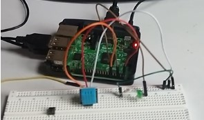

# Weatherapp
## Introduction
<p>The objective of this project is to design a system that will allow an individual to monitor the temperature, the humidity and lighting of his/her home. The house will be equipped with sensors and actuators (for lighting), all connected to a transmission medium (a raspberry PI 3). I made a web application to allow the user to visualize the data of the sensors and to activate the lighting of the room.</p>

### Architecture
<p></p>


# Installation Guide

## The wiring
### Necessary equipment
<p></p>

### wiring
<p></p>

<p></p>

<p>Connect the pins of the DHT11 sensor and the led as shown on the diagram. <b>Be careful to connect the vcc pin to the 3.3V ** of the raspberry and not to the 5V</b></p>

## The Front end
<p></p>

- To connect the web application to the Raspberry, the Raspberry and the PC hosting the application must be on the same network.
- Make sure you have node and angular CLI installed on your PC
- Clone this repo
````git clone repo ````
- Open the project and open a terminal
- Install all the dependances simply run the cmd
````npm install````
- Run the application
Run `ng serve` for a dev server. Navigate to `http://localhost:4200/`. The application will automatically reload if you change any of the source files.

- **Get the raspberry's ip address**
- Turn on the raspberry and open a terminal.
- Type the command ````hostname -I```` and ***copy the ip address***
- Enter the address in the application
- Go to the ***src/environment*** folder and replace the value of ````SERVER_ADDR : THE IP ADDRESS````variable with the address you copied.
- restart the application

## The Back end
- Make sure you have made the connections as described in the previous section (see figures)
- clone the Adafruit_Python_DHT repository which contains the dependencies for handling the DHT11 sensor
`git clone https://github.com/adafruit/Adafruit_Python_DHT.git`
`sudo pip3 install Adafruit_Python_DHT (for python3)`
- Go to the  examples directory
`cd Adafruit_Python_DHT/examples`
- Install some dependencies
`sudo apt-get install build-essential python-dev`
`sudo python setup.py install`
- **Create your file in this same directory** 
`Adafruit_Python_DHT/examples/your_file.py`
- Insert the following code: backend.py in your_file.py
